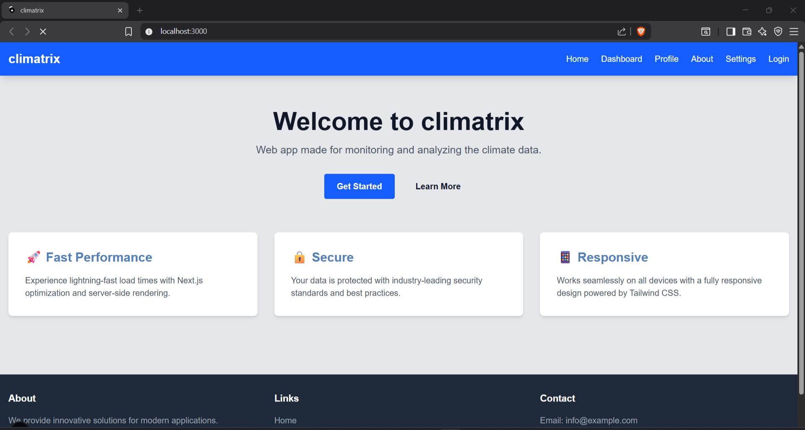

# Climatrix - Climate Intelligence Dashboard

[](https://github.com/kalviumcommunity/s66-0126-Mosiac-Full-Stack-With-NextjsAnd-AWS-Azure-Supply-Chain/actions/workflows/ci.yml)
[](https://github.com/kalviumcommunity/s66-0126-Mosiac-Full-Stack-With-NextjsAnd-AWS-Azure-Supply-Chain/actions/workflows/cd.yml)
[](https://github.com/kalviumcommunity/s66-0126-Mosiac-Full-Stack-With-NextjsAnd-AWS-Azure-Supply-Chain/actions/workflows/docker.yml)

Climatrix is a climate intelligence dashboard designed to help citizens understand complex environmental data through clear visualizations and actionable insights. Since different parts of the application have different data freshness and performance requirements, we use Static Rendering (SSG), Dynamic Rendering (SSR), and Hybrid Rendering (ISR) strategically to optimize speed, scalability, and accuracy.

## 🚀 Quick Links

- 📖 [Setup Guide](frontend/QUICK_START.md)
- 🐳 [Docker Guide](DOCKER.md)
- 🔄 [CI/CD Documentation](CICD.md)

---

## Rendering Modes Used in Climatrix

### 1. Static Rendering (SSG)

Pages using SSG:
- Home Page
- About Page
- FAQ / Awareness Page

Why Static Rendering was chosen:  
These pages contain informational and educational content that does not change frequently. Rendering them at build time ensures extremely fast load times, better SEO, and zero server cost per request.

Implementation:
```js
export const revalidate = false;
```

Impact on Performance & UX:
- Lightning-fast page loads
- Served directly from CDN
- Ideal for first-time visitors and public access

---

### 2. Dynamic Rendering (SSR)

Pages using SSR:
- User Dashboard
- Real-time Air Quality (AQI) Page
- User Profile (location-based data)

Why Dynamic Rendering was chosen:  
Climate data such as air quality and pollution levels can change hourly and directly affect health decisions. These pages must always show the most up-to-date information.

Implementation:
```js
export const dynamic = 'force-dynamic';

const data = await fetch(API_URL, { cache: 'no-store' });
```

Impact on Performance & UX:
- Always fresh and accurate data
- Slightly higher server cost
- Essential for real-time decision-making

---

### 3. Hybrid Rendering (ISR – Incremental Static Regeneration)

Pages using ISR:
- City Climate Overview
- Weekly Temperature Trends
- Pollution History Pages

Why Hybrid Rendering was chosen:  
These pages receive high traffic but do not require real-time updates every second. ISR allows pages to remain fast while updating periodically.

Implementation:
```js
export const revalidate = 3600; // revalidate every 1 hour
```

Impact on Performance & UX:
- Fast like static pages
- Automatically updated data
- Reduced server load with good freshness balance

---

## Summary Table

| Page Type        | Rendering Mode | Reason                            |
|------------------|----------------|-----------------------------------|
| Home / About     | SSG            | Static content, SEO-focused       |
| Dashboard        | SSR            | Live, real-time climate data      |
| City Overview    | ISR            | Periodic updates, high traffic    |

---

## Performance & Scalability Benefits

- SSG reduces Time-To-First-Byte (TTFB) and improves SEO  
- SSR ensures data accuracy for critical climate insights  
- ISR balances scalability and freshness, reducing server costs

---

## Reflection: Scaling to 10x Users

If Climatrix scaled to 10x more users, using SSR for all pages would significantly increase server load and cost. To handle scale efficiently, we would shift more pages to Static Rendering or ISR, caching commonly accessed climate summaries while reserving SSR only for pages that truly require real-time data. This approach improves scalability, reduces infrastructure cost, and maintains a fast user experience.

---

## Conclusion

By combining Static, Dynamic, and Hybrid rendering strategies, Climatrix leverages Next.js App Router effectively to deliver a performant, scalable, and real-world-ready application. Choosing the correct rendering strategy for each page ensures optimal speed, cost efficiency, and data reliability.
## Understanding Cloud Deployments: Docker → CI/CD → AWS/Azure

### Overview
Climatrix is prepared for cloud deployment using modern DevOps practices such as Docker, CI/CD pipelines, and cloud hosting on AWS or Azure. The goal is to ensure consistent builds, automated deployments, and secure configuration management.

---

### Docker
Docker is used to containerize the application along with its dependencies, ensuring it runs the same across all environments (development, staging, production).

**Benefits:**
- Consistent runtime environment
- Easy portability
- Eliminates “works on my machine” issues

---

### CI/CD (GitHub Actions)
CI/CD automates the build and deployment process.

**Workflow:**
- Triggered on push or merge to `main`
- Installs dependencies and builds the app
- Builds Docker images
- Uses GitHub Secrets for sensitive data

**Why CI/CD:**
- Faster deployments
- Reduced human error
- Reliable and repeatable releases

---

### Cloud Deployment (AWS / Azure)
The application can be deployed using:
- **AWS**: EC2 / Elastic Beanstalk, S3
- **Azure**: App Service / Container Apps

Separate environments (dev, staging, production) are maintained for stability.

---

### Secrets & Environment Management
- No secrets committed to GitHub
- Sensitive values stored in **GitHub Secrets**
- `.env.example` tracked, actual `.env` files ignored

---

### Reflection
- **Challenges:** Environment variables and CI/CD setup
- **Learnings:** Automation improves reliability and scalability
- **Next Steps:** Add testing and Infrastructure as Code (IaC)

---

### Conclusion
Using Docker, CI/CD, and cloud platforms helps Climatrix achieve secure, scalable, and production-ready deployments following real-world industry practices.

##  Project Folder Structure

src/
├── app/
│ ├── page.tsx # Homepage (Location selection)
│ ├── dashboard/page.tsx # Climate dashboard
│ ├── actions/page.tsx # Action center
│ ├── community/page.tsx # Community & impact
│ ├── layout.tsx # Root layout
│ └── globals.css # Global styles
│
├── components/
│ ├── common/ # Reusable UI components
│ ├── dashboard/ # Charts & metrics
│ ├── actions/ # Action components
│ └── community/ # Community UI
│
└── lib/
├── api/ # API logic
└── utils/ # Helper functions


##  Screen Routes

- `/` → Homepage  
- `/dashboard` → Main Dashboard  
- `/actions` → Action Center  
- `/community` → Commununity & impacts  

The website running locally:



# Tooling and Code Quality Documentation

This document explains how TypeScript strict mode, ESLint, Prettier, and pre-commit hooks are used in this project to reduce bugs and maintain consistent code quality.

---

## Why Strict TypeScript Mode Reduces Runtime Bugs

Strict TypeScript mode helps identify errors at compile time instead of runtime. When strict mode is enabled, TypeScript checks for issues such as null or undefined values, incorrect variable types, and missing function arguments. This prevents common JavaScript errors that could otherwise cause the application to crash while running. By catching these problems early, strict mode improves reliability and reduces runtime bugs.

---

## ESLint and Prettier Rules Used

ESLint is used to enforce code quality and prevent common mistakes such as unused variables and incorrect syntax. It ensures that the code follows best practices and remains clean. Prettier is used to maintain consistent formatting across the project, including rules like using single quotes, adding semicolons, and proper indentation. Together, ESLint and Prettier make the code easier to read and maintain.

---

## How Pre-commit Hooks Improve Team Consistency

Pre-commit hooks automatically run checks before code is committed to the repository. In this project, a pre-commit hook runs ESLint to ensure there are no linting errors. If an issue is found, the commit is blocked until the problem is fixed. This ensures that all team members follow the same coding standards and prevents broken or poorly formatted code from being pushed.

---

## ESLint Logs and Verification

The following command was used to check for linting issues:

```bash
npx eslint .

after running the output is empty meaning there was no errors